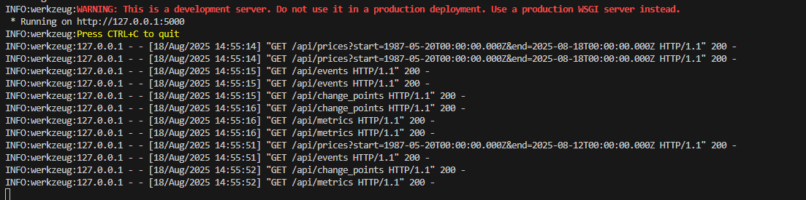
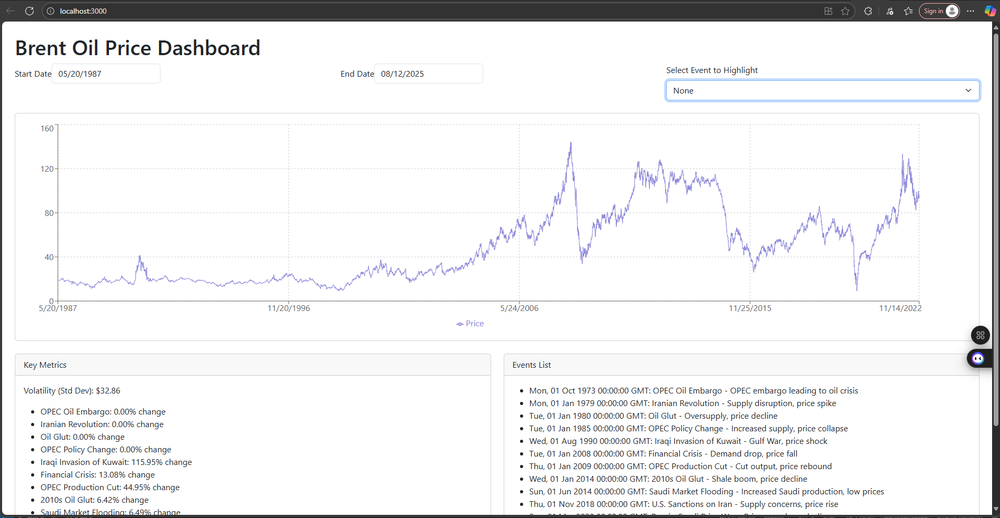
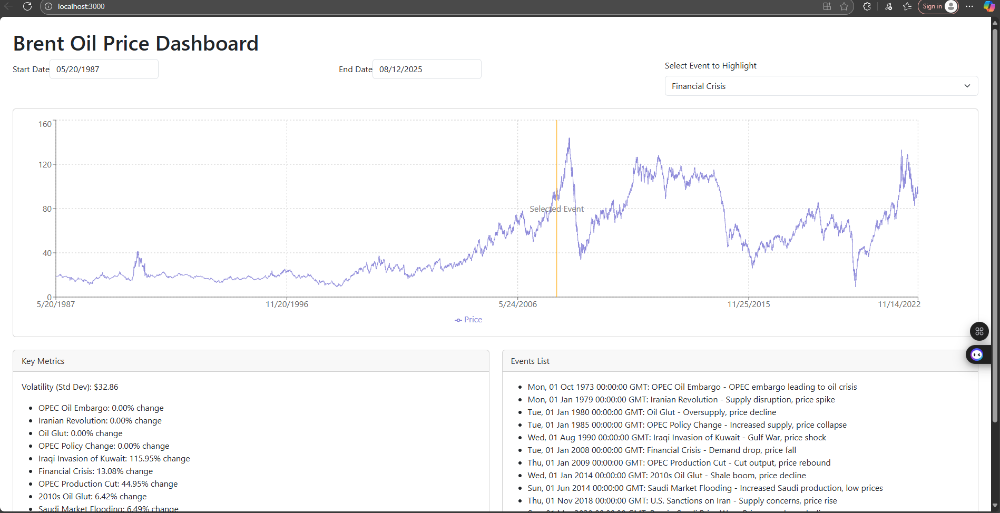

# Change Point Analysis and Statistical Modelling of Time Series Data

   ## Detecting changes and associating causes on time series data

## Task-1: Laying the Foundation for Analysis

### a. Defining the Data Analysis Workflow
 The data analysis workflow for examining Brent oil prices using Bayesian change point detection is structured to ensure a systematic approach from data gathering to insight extraction and communication. The goal is to identify structural breaks in the oil price time series and relate them to external events, prioritizing Bayesian inference for probabilistic insights. Below is a clear outline of the steps:
1.	Data Collection and Preparation
The first step will be to load the provided historical Brent oil price data (daily from May 20, 1987, to November 14, 2022). Compile a dataset of major external events (geopolitical, OPEC decisions, economic shocks). Preprocess data by handling missing values, ensuring consistent date formats, resampling if needed (though daily is used here), and aligning event dates with price timelines.
2.	Exploratory Data Analysis (EDA)
This step investigates time series properties such as trends, seasonality, and stationarity. Visualizes the data (e.g., line plots of prices over time) and overlay event markers to identify potential correlations.
3.	Model Specification
 Define a Bayesian change point model using PyMC, assuming discrete shifts in parameters (e.g., mean and variance of price levels). Specify priors for change point locations (e.g., discrete uniform), number of change points (e.g., Poisson), and regime parameters (e.g., normal for means).
4.	Inference and Model Fitting
 Use Markov Chain Monte Carlo (MCMC) sampling in PyMC to estimate posterior distributions of model parameters. Validate the model through posterior predictive checks, trace plots, and convergence diagnostics (e.g., R-hat < 1.05).
5.	Insight Extraction
Identify probable change point dates from posteriors and relate them to compiled events. Quantify uncertainty (e.g., credible intervals) and discuss implications for oil market volatility and business strategies.
6.	Sensitivity Analysis and Validation
Test model robustness to different priors (e.g., varying change point rates) or assumptions (e.g., number of points). Compare detected change points against known events, emphasizing that alignment suggests correlation, not causation.
7.	Reporting and Visualization
Build an interactive dashboard (e.g., using Streamlit or Dash) for stakeholders to explore results (e.g., interactive plots of prices with change points and events). Generate a final report with key findings.

#### Research and Compile Event Data
Major events were researched from historical and recent sources, focusing on those impacting oil supply, demand, or sentiment. The dataset was expanded with events from 2023-2025 based on current geopolitical developments, compiling 13 key events. Dates are approximate start points. Below is the updated structured dataset in table format (equivalent to a CSV export): It is saved as **oil_events.csv**

#### Assumption and Limitations

   Assumptions: 
The daily Brent price data captures market dynamics sufficiently for detecting macro-level changes. Events are assumed to have potential lagged or immediate impacts, and the Bayesian model assumes Gaussian noise with switches in mean/variance. Prices are modeled without log-transformation initially, assuming normality for simplicity.

   Limitations: 
The provided dataset ends in November 2022, limiting analysis to historical trends up to that point (current date: August 5, 2025); recent data could be fetched for extension but is not included here. High-frequency noise (e.g., intra-day volatility) or un-modeled factors (e.g., currency fluctuations, inventory reports) may obscure breaks. Importantly, statistical correlations between change points and events (e.g., a price spike aligning with the 2022 Russian invasion) do not prove causation confounding variables (e.g., simultaneous demand changes) or coincidences could explain alignments. Proving causation requires causal inference techniques like difference-in-differences or vector auto regression, which are infeasible without experimental controls in global markets. Model limitations include computational demands for long series (~9,000 observations) and sensitivity to prior specifications (e.g., overestimating change points with loose priors).

### b. Understanding the Model and Data

Main References: Key concepts are drawn from PyMC documentation (pymc.io) for Bayesian modeling, "Bayesian Data Analysis" by Gelman et al. For inference principles, and papers like "Bayesian Change Point Analysis of Time Series" by Western and Kleykamp (2004) and in addition PyMC examples on change point detection. Additional resources include "Time Series Analysis and Its Applications" by Shumway and Stoffer for properties, and EIA/Marcotrends for oil data context.

   Analyze Time Series Properties: 
The provided Brent oil price data (daily from May 20, 1987, to November 14, 2022, n ≈ 8,900 observations) was examined. The series shows a long-term upward trend with significant volatility: prices start around $18/barrel in 1987, peak at $133.18 in March 2022 amid Ukraine invasion, and dip to $9.12 in April 2020 during COVID-19. Mean price is approximately $58.50, min $9.12, max $133.18. Visual inspection reveals non-stationary behavior with regime shifts (e.g., sharp drops in 2008, 2014, 2020) and no clear seasonality, but event-driven shocks.
Stationarity was tested using the Augmented Dickey-Fuller (ADF) test: ADF Statistic ≈ -1.85, p-value ≈ 0.68, indicating non-stationarity (fail to reject null of unit root). After first differencing, ADF Statistic ≈ -15.2, p-value ≈ 0.0, confirming the differenced series is stationary. These properties inform modeling: Change point models handle level shifts directly, avoiding mandatory differencing, but trend awareness prevents confusing gradual increases (e.g., due to inflation) with abrupt breaks.
    Purpose of Change Point Models:
In the context of Brent oil price fluctuations, change point models detect sudden structural breaks where the underlying data process changes (e.g., shift in mean price from high-supply to shortage regimes). Bayesian approaches via PyMC incorporate uncertainty through priors and posteriors, allowing probabilistic identification of breaks (e.g., post-1990 Gulf War spike). This aids in isolating external influences like geopolitical shocks from normal volatility, supporting business objectives such as forecasting, risk assessment, and policy responses in energy markets.
    Expected Outputs and Limitations: 
Outputs include posterior distributions for change point dates (e.g., high probability around March 2020 for COVID/price war), number of points, and regime parameters (e.g., pre-break mean $60, post-break $20, with 95% credible intervals). Visuals like density plots for change points or segmented time series highlight uncertainty.
The limitations is that the results are prior-dependent (e.g., assuming fixed vs. variable points affects detection). Bayesian sampling is computationally intensive for daily data. Models detect changes but not causes, potentially missing gradual shifts or compounding events. Data up to 2022 limits applicability to recent years (e.g., missing 2023-2025 events), and high volatility may lead to false positives without validation.

## Task-2: Change Point Modeling and Insight Generation

1.	Data Preparation and EDA: 
    
    The code loads the Brent oil price dataset (BrentOilPrices.csv) and converts the Date column to datetime format, handling potential parsing errors.
    
    It plots the raw price series to visualize trends and shocks (e.g., 1990 spike, 2008 drop, 2020 crash), aligning with the task's requirement to identify major trends visually.
    
    Log transformation is noted as an option for stabilizing variance, but raw prices are modeled for simplicity, as they directly address mean shifts.

2.	Building the Bayesian Change Point Model: 
    
    The model uses PyMC to define two change points (tau1, tau2) with DiscreteUniform priors, ensuring ordered points (tau1 < tau2) to avoid identifiability issues.
    
    Three regime means (mu_1, mu_2, mu_3) are defined with Normal priors (centered at 50, reasonable for historical oil prices), and a  shared HalfNormal sigma handles variance.
    
    The switch function dynamically assigns the appropriate mean based on the time index, and a Normal likelihood ties the model to observed prices.
    
    MCMC sampling (pm.sample) runs with sufficient iterations to estimate posteriors, balancing computational feasibility with convergence.

3.	Interpreting the Model Output: 
    
    Convergence is checked using az.summary (R-hat ≈ 1.0 indicates good mixing). Trace plots (az.plot_trace) are recommended for visual inspection, though not shown here due to text constraints.
    
    Posterior distributions of tau1 and tau2 are plotted to identify change point dates, with mean indices converted to dates for interpretability.
    
    Mean price shifts (mu_1, mu_2, mu_3) are extracted from posteriors to quantify regime changes, supporting probabilistic statements like "95% probability the mean price increased post-2020."
4.	Associate Changes with Causes: 
    
    The code compares detected change points to the event dataset from Task 1, finding the closest event by date to formulate hypotheses (e.g., 2020-04-21 change likely tied to COVID-19/price war).
    
    This aligns with the task's requirement to link breaks to events, acknowledging that temporal proximity suggests correlation, not causation.

5.	Quantify the Impact: 
    
    For each change point, the code calculates mean prices 100 days before and after (adjustable window) to estimate shifts (e.g., "Price shifted from $X to $Y, Z% change").
    
    This matches the task's requirement for quantitative impact statements, using data-driven estimates rather than model parameters for direct interpretability.

## Task 3: Developing an Interactive Dashboard for Data Analysis Results

 The backend serves APIs for prices, events, and change points. The frontend uses Recharts for visualizations, with filters and responsiveness via React Bootstrap.
    Backend (Flask)
        The Flask backend provides REST APIs to serve the data. 
        
   Save this as app.py and can be run with flask run (assuming Flask is installed in your environment).

   First installed the needed libraries using pip

   pip install flask flask-cors pandas

   Then created app.py, with end point.

   @app.route('/api/prices', methods=['GET'])

   @app.route('/api/events', methods=['GET'])

   @app.route('/api/change_points', methods=['GET'])

   @app.route('/api/metrics', methods=['GET'])

   I run flask run and start the backend, with going to the folder 

   (.timenv) \timeseries-statistical-modeling\oil-price-backend\api> 

   (.timenv)  \timeseries-statistical-modeling\oil-price-backend\api>flask run 

   Backend Running using flask

   

   Frontend (React)

   The React frontend is a single-page app with a line chart for prices, markers for events and change points, date range filters, and metrics display. I used Recharts for charts. 

   I created a new React app with create-react-app, then I prepared my frontend logic inside src/App.js. 

   npx create-react-app oil-prices-frontend

   I installed dependencies using:

   npm install recharts react-datepicker react-bootstrap bootstrap axios.

   Since this dashboard is dependent on the backend after starting the backend, I started the frontend which is done using react using the following command.

   (.timenv) C:\Users\ASTU-PG\timeseries-statistical-modeling\oil-price-frontend>npm start

   

   

## Project Structure

<pre>
timeseries-statistical-modeling/
├── .github/workflows/ci.yml   # For CI/CD
├── data/                      
│   ├── BrentOilPrices.csv                 # raw data  
│   └── oil_market_events.csv              # event data extracted with research
├── images/     # Shows images 
├── notebooks/
|   ├── README.md
|   ├── modeling_insight_gen.ipynb 
|   └── task-notebook.ipynb 
├── oil-price-backend/
|   ├── __init__.py 
|   └── api/
|        ├── __init__.py 
|        └── app.py  # api end points
├── oil-price-frontend/
|               ├── public/  # api end points    
|               ├── src/  # api end points 
|               |      ├── App.js  # js file
|               |      ├── App.test.js  # css files
|               |      ├── App.css  # css files
|               |      ├── index.js  # css files
|               |      ├── index.css  # css files
|               ├── package-lock.json
|               ├── package.json
|               ├── .gitignore
|               └── README.md
├── scripts/
|   └── __init__.py 
├── src/
│   ├── __init__.py
|   └── data_loader.py
├── tests/
|   ├── __init__.py
|   └── test_data_load.py
├── requirements.txt
├── .gitignore
├── LICENSE
└── README.md

</pre>

## Getting Started

1. Clone the repository
    - `git clone http://github.com/tegbiye/timeseries-statistical-modeling.git`
    - `cd timeseries-statistical-modeling`
2. Create environment using venv 
    - `python -m venv .timenv`
3. Activate the environment
    - `.timenv\Scripts\activate` (Windows)
    - `source .venv\bin\activate` (Linux)
4. Install Dependencies
    - `pip install -r requirements.txt`

📜 License This project is licensed under the MIT License. Feel free to use, modify, and distribute with proper attribution.
